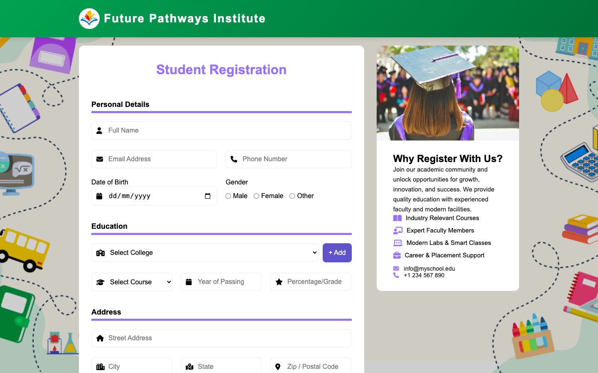
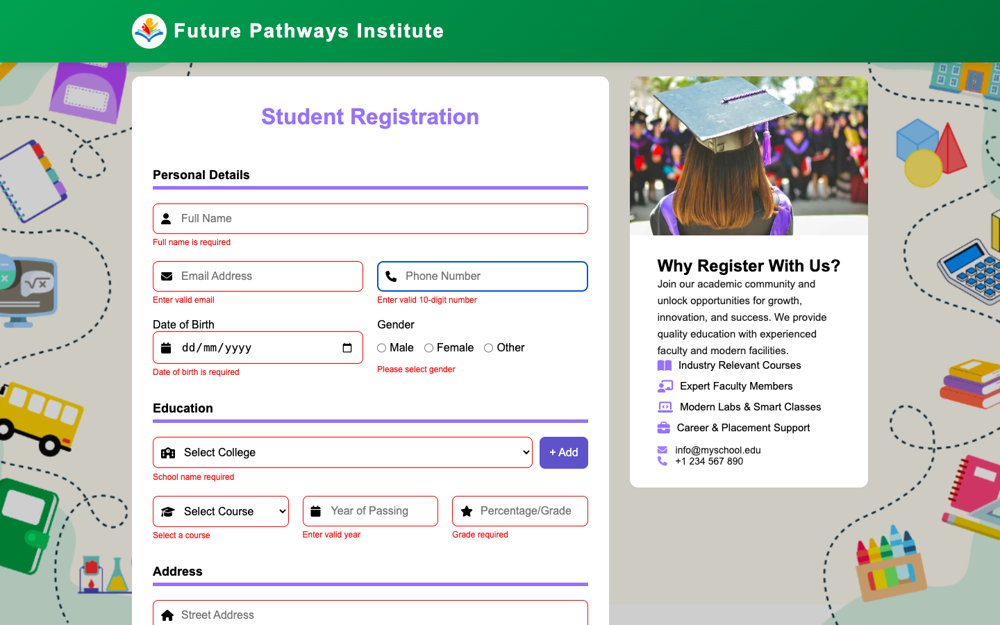

# Student Registration Form

## Description

This project is a **Student Registration Form** for collecting student details for **Future Pathways Institute**.

It captures:

- Personal details
- Educational details
- Address information
- Parent/Guardian details

The form includes **advanced client-side validation** with dynamic error messages displayed below each field (no alert popups).

---

## Features

- Fully responsive layout (HTML5 & CSS3)
- Advanced JavaScript validation
- Error messages shown below each field
- Red border highlighting invalid fields
- Minimum age validation (15 years)
- Percentage range validation (0–100)
- Indian phone number validation (starts with 6–9)
- Parent contact/email must differ from student
- College dropdown with:
  - Add new college
  - Stored in localStorage
  - Auto-load on refresh

- Structured JavaScript object created on successful submission

---

## Technologies Used

- HTML5
- CSS3
- JavaScript (Vanilla)
- Font Awesome (Icons)
- localStorage API

---

# Form Fields & Validation Rules

## Personal Details

| Field         | Validation Rule                     | Error Message                                |
| ------------- | ----------------------------------- | -------------------------------------------- |
| Full Name     | Required, letters only (3–50 chars) | Full name is required / Only letters allowed |
| Email         | Required, valid email format        | Enter valid email format                     |
| Phone Number  | 10 digits, starts with 6–9          | Enter valid 10-digit number                  |
| Date of Birth | Required, Minimum age 15            | Minimum age should be 15                     |
| Gender        | Must be selected                    | Please select gender                         |

---

## Education Details

| Field              | Validation Rule               | Error Message                  |
| ------------------ | ----------------------------- | ------------------------------ |
| College            | Must be selected              | Please select college          |
| Course             | Must be selected              | Please select course           |
| Year of Passing    | Between 1950 and current year | Enter valid year               |
| Grade / Percentage | 0–100 only                    | Enter valid percentage (0–100) |

---

## Address Details

| Field          | Validation Rule      | Error Message                         |
| -------------- | -------------------- | ------------------------------------- |
| Street Address | Minimum 5 characters | Address must be at least 5 characters |
| City           | Letters only         | Enter valid city name                 |
| State          | Letters only         | Enter valid state name                |
| Postal Code    | Exactly 6 digits     | Postal code must be 6 digits          |

---

## Parent / Guardian Details

| Field          | Validation Rule                  | Error Message                             |
| -------------- | -------------------------------- | ----------------------------------------- |
| Father’s Name  | Required, letters only           | Father name required                      |
| Mother’s Name  | Required, letters only           | Mother name required                      |
| Parent Contact | 10 digits, not same as student   | Parent number cannot match student number |
| Parent Email   | Valid email, not same as student | Parent email cannot match student email   |

---

# College Dropdown Feature

- Default colleges are loaded automatically.
- Users can add new college names.
- New colleges are saved in **localStorage**.
- Colleges persist even after page refresh.

---

## Form Data Structure (Example)

```javascript
const formData = {
  name: "Rahul Sharma",
  contact: { email: "rahul@example.com", phone: "9876543210" },
  dob: "2000-01-01",
  gender: "male",
  education: {
    school: "BBDU",
    course: "science",
    yearOfPassing: 2022,
    grade: "88",
  },
  address: {
    address: "123 Main Street",
    city: "Delhi",
    state: "Delhi",
    postalCode: "110001",
  },
  parents: {
    fatherName: "Rajesh Sharma",
    motherName: "Sunita Sharma",
    parentContact: "9876543211",
    parentEmail: "parents@example.com",
  },
};
```

---

## File Structure

```
project-folder/
│
├─ index.html
├─ style.css
├─ script.js
└─ assets/
   ├─ logo.png
   ├─ side.png
   ├─ preview.png
   └─ preview-error.png
```

---

## Usage

1. Clone the repository

```bash
git clone https://github.com/prashant-srivastav-iphtech/Student-Registration-Form-.git
```

2. Open `index.html` in your browser
3. Fill in the registration form
4. Click **Submit**
5. If validation passes → Data logs in console

---

## Screenshots

### On Load



### Validation Messages



---

## Validation System

- Prevents form submission if any field is invalid
- Displays inline error messages
- Highlights invalid fields
- Clears errors on resubmit
- Ensures clean, structured data output
